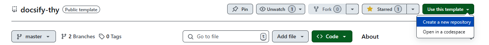
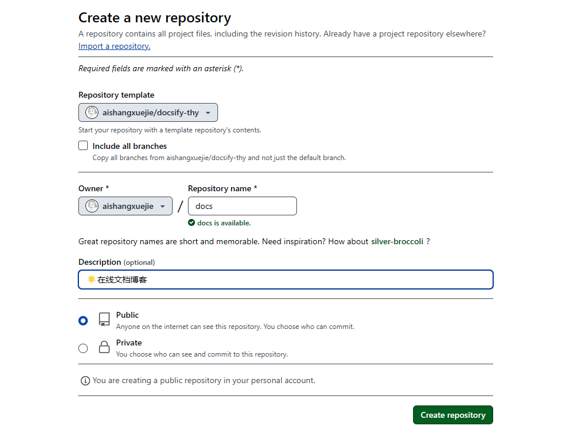
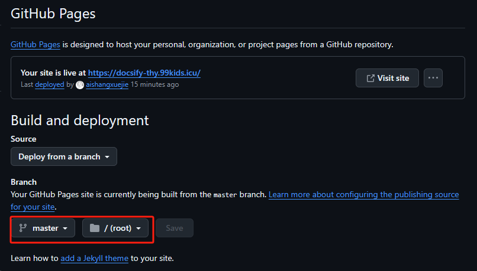

# 🏡This's a docsify thymeleaf

🌟这是一个 Docsify 模板，你可以使用此模板 [docsify-thy](https://github.com/aishangxuejie/docsify-thy)创建自己新的库，或者Fork到自己的库，然后直接部署在 GitHub Pages。

🌟模板设置了2个文件夹，并配置不同的首页作为不同空间，你可以用来写不同类型的文档博客。

## 预览

- 模板预览：https://docsify-thy.99kids.icu/

## 插件

- [x] 定制导航栏
- [x] 配置多页文档
- [x] 添加查询插件
- [x] emoji
- [x] 代码复制到剪贴板
- [x] 分页导航
- [x] 字数统计
- [x] 图片缩放
- [x] 自定义广告位

## 部署

🌟仅需3步，如此简单！

> 和 GitBook 生成的文档一样，我们可以直接把文档网站部署到 GitHub Pages 或者 VPS 上。

### 1、使用模板（或者Fork）

### 2、创建新的名

### 3、发布GitHub Pages

GitHub Pages 支持从三个地方读取文件

- `docs/` 目录
- master 分支
- gh-pages 分支

在设置页面开启 **GitHub Pages** 功能并选择 `master branch /(root) folder` 选项。

