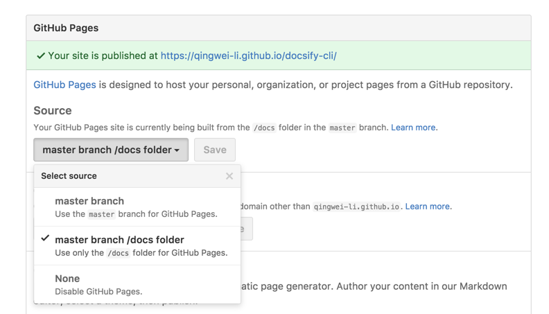

# 🏡This's docsify thymeleaf

​	这是一个 Docsify 模板，你可以直接Fork到自己的仓库，然后直接[部署在 GitHub Pages](https://docsify.js.org/#/zh-cn/deploy)。

## 已配置

- [x] 定制导航栏
- [x] 配置多页文档
- [x] 添加查询插件
- [x] emoji
- [x] 代码复制到剪贴板
- [x] 分页导航
- [x] 字数统计
- [x] 图片缩放
- [x] 自定义广告位

## 部署

和 GitBook 生成的文档一样，我们可以直接把文档网站部署到 GitHub Pages 或者 VPS 上。

### GitHub Pages

GitHub Pages 支持从三个地方读取文件

- `docs/` 目录
- master 分支
- gh-pages 分支

我们推荐直接将文档放在 `docs/` 目录下，在设置页面开启 **GitHub Pages** 功能并选择 `master branch /docs folder` 选项。

可以将文档放在根目录下，然后选择 **master 分支** 作为文档目录。你需要在部署位置下放一个 `.nojekyll` 文件（比如 `/docs` 目录或者 gh-pages 分支）
